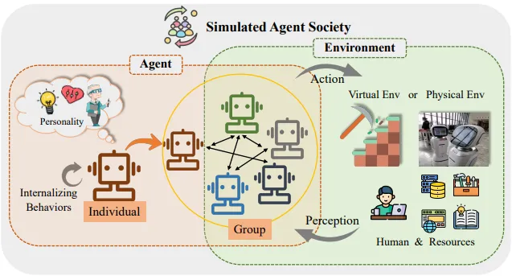

# Research

For the most up-to-date list of publications, please visit our [Google Scholar profile](https://scholar.google.com/citations?user=k0KJm7kAAAAJ&hl=en). Below, we highlight our representative works in each active research direction. Following that, we provide a categorized list of our publications based on their type.

## All

RT RL Theory | RA RL Algorithm | RAPP RL Application | LLM Large Language Model | RO Robotics | GM Generative Model | FU Fusion

### Preprints and In-Submission Works:

1. Rohit Sonker, Hiro Josep Farre Kaga, Jiayu Chen, Andrew Rothstein, Ian Char, Ricardo Shousha, Egemen Kolemen, and Jeff Schneider, "Offline Reinforcement Learning for Rotation Profile Control in Tokamaks", submitted to Annual Learning for Dynamics and Control Conference (L4DC), 2026. RAPP FU

1. Xudong Wu, Pangpang Liu, Vaneet Aggarwal, and Jiayu Chen, "On the Convergence of Self-Improving Online LLM Alignment", submitted to International Conference on Artificial Intelligence and Statistics (AISTATS), 2026. RT LLM

1. Wentse Chen, Yuxuan Li, Shiyu Huang, Jiayu Chen, and Jeff Schneider, "[ME-IGM: Individual-Global-Max in Maximum Entropy Multi-Agent Reinforcement Learning](http://arxiv.org/abs/2406.13930)", submitted to International Conference on Autonomous Agents and Multiagent Systems (AAMAS), 2026. RA

1. Yichen Zhu, Weiyu Chen, Zhou Zhao, Jiayu Chen, and James Kwok, "Keep Refining Your Discrete Diffusion Model: A Mixture of Absorbing and Uniform Processes", submitted to International Conference on Learning Representations (ICLR), 2026. LLM GM

1. Wentse Chen, Jiayu Chen, Hao Zhu, Fahim Tajwar, Ruslan Salakhutdinov, and Jeff Schneider, "Verlog: An Efficient Synchronized Multi-turn RL Framework for LLM Agents", submitted to International Conference on Learning Representations (ICLR), 2026. LLM RA 

1. Aravind Venugopal, Jiayu Chen, Xudong Wu, Chongyi Zheng, Benjamin Eysenbach, and Jeff Schneider, "Occupancy Reward Shaping: Improving Credit Assignment for Offline Goal-Conditioned Reinforcement Learning", submitted to International Conference on Learning Representations (ICLR), 2026. RA

1. Jiayu Chen, Zhekai Wang, and Vaneet Aggarwal, "[Hierarchical Deep Counterfactual Regret Minimization](https://arxiv.org/abs/2305.17327)", submitted to International Conference on Learning Representations (ICLR), 2026. RA RT 

1. Jiayu Chen, Le Xu, Aravind Venugopal, and Jeff Schneider, "[Policy-Driven World Model Adaptation for Robust Offline Model-based Reinforcement Learning](https://arxiv.org/abs/2505.13709)", submitted to International Conference on Learning Representations (ICLR), 2026. RA FU

1. Jiayu Chen, Le Xu, Wentse Chen, and Jeff Schneider, "[Bayes Adaptive Monte Carlo Tree Search for Offline Model-based Reinforcement Learning](https://arxiv.org/abs/2410.11234)", submitted to International Conference on Learning Representations (ICLR), 2026. RA FU

1. Chongyu Zhu, Mithun Vanniasinghe, Jiayu Chen, and Chi-Guhn Lee, “Offline Discovery of Interpretable Skills from Multi-Task Trajectories”, submitted to IEEE International Conference on Robotics & Automation (ICRA), 2026. RA RO

1. Mingqi Yuan, Tao Yu, Wenqi Ge, Xiuyong Yao, Dapeng Li, Huijiang Wang, Jiayu Chen, Xin Jin, Bo Li, Hua Chen, Wei Zhang, and Wenjun Zeng, "[Behavior Foundation Model: Towards Next-Generation Whole-Body Control System of Humanoid Robots](https://arxiv.org/pdf/2506.20487)", submitted to IEEE Transactions on Pattern Analysis and Machine Intelligence (TPAMI). RO RAPP

1. Hyunsoo Choi, Jiayu Chen, Vaneet Aggarwal, and Zubin Jacob, "TURBO-RL: Turbulence Mitigation Using Reinforcement Learning for Severe Optical Aberrations", submitted to Applied Physics Letters. RAPP

1. Bhargav Ganguly, Abhimanyu Shekhar, Chang-Lin Chen, Jiayu Chen, Vaneet Aggarwal, Shweta Singh, "A Deep Reinforcement Learning Approach for Circular Economy Management", submitted to Nature Sustainability. RAPP

1. Wenyan Xu, Dawei Xiang, Rundong Wang, Yonghong Hu, Jiayu Chen, and Zhonghua Lu, "FTS-Text-MoE: A Financial Time-Series Text Language Model Based on a Mixture of Experts Mechanism", submitted to AAAI Workshop on Agentic AI in Financial Services, 2026. LLM

1. Selina Carter, Jiayu Chen, and Jeff Schneider, "Variance-free Inference of Neural Network Ensembles for Uncertainty Quantification", in progress. RA RT 

### Workshop Papers (without proceedings):

1. Ricardo Shousha, Hiro Farre, Peter Steiner, Jaemin Seo, Rohit Sonker, Jiayu Chen, Keith Erickson, Andy Rothstein, SangKyeun Kim, Z.A. Xing, Suk-Ho Hong, Yilun Zhu, and Egemen Kolemen, "Toward ITER-Relevant Robust Plasma Profile Control Using AI-Based RTCAKENN in Diagnostically Challenged Environments", Annual Meeting of the APS Division of Plasma Physics (APS-DPP), 2025. GM FU

1. Rohit Sonker, Hiro Farre, Jiayu Chen, Andy Rothstein, Aravind Venugopal, Namrata Deka, Ian Char, Ricardo Shousha, Egemen Kolemen, and Jeff Schneider, "Offline Reinforcement Learning for Rotation and Density Profile Control in Tokamaks", Annual Meeting of the APS Division of Plasma Physics (APS-DPP), 2025. RAPP FU

1. Wentse Chen, Jiayu Chen, Hao Zhu, and Jeff Schneider, "Context-lite Multi-turn Reinforcement Learning for LLM Agents", accepted in ICML Workshop on Efficient Systems for Foundation Models, 2025. LLM RAPP

1. Wenyan Xu, Jiayu Chen, Chen Li, Yonghong Hu, and Zhonghua Lu, "[Mining Intraday Risk Factor Collections via Hierarchical Reinforcement Learning based on Transferred Options](https://arxiv.org/abs/2501.07274)", accepted in AAAI 2025 Workshop on AI for Social Impact (**Oral presentation**). RAPP

1. Chang-Lin Chen, Jiayu Chen, Tian Lan, Elaine Zhao, Hongbo Dong, and Vaneet Aggarwal, "[Rack Position Optimization in Large-Scale Heterogeneous Data Centers](https://arxiv.org/html/2504.00277v1)", accepted in AAAI/INFORMS Bridge: AI+ORMS, Dec 2024 (**Full presentation**). RAPP

1. Wentse Chen, Jiayu Chen, Fahim Tajwar, Hao Zhu, Xintong Duan, Russ Salakhutdinov, and Jeff Schneider, "[Fine-tuning LLM Agents with Retrospective In-Context Online Learning](https://openreview.net/forum?id=dSZ6Wr5qRz)", accepted in NeurIPS Adaptive Foundation Models Workshop, Oct 2024 (**Oral presentation**). LLM

1. Jiayu Chen, Marina Wagdy Wadea Haliem, Tian Lan, and Vaneet Aggarwal, "[Multi-agent Deep Covering Option Discovery](https://arxiv.org/abs/2210.03269)", accepted in ICML Reinforcement Learning for Real Life Workshop, Jul 2021. RA

### Conference Papers (with proceedings):

1. Yiming Wang, Kaiyan Zhao, Ming Yang, Yan Li, Furui Liu, Jiayu Chen, and Leong Hou U, "DSAP: Enhancing Generalization in Goal-Conditioned Reinforcement Learning", accepted in Annual AAAI Conference on Artificial Intelligence (AAAI), 2026. RA RT

1. Yiming Wang, Kaiyan Zhao, Xu Li, Yan Li, Jiayu Chen, Steven Morad, and Leong Hou U, “Explore to Learn: Latent Exploration through Disentangled Synergy Patterns for Reinforcement Learning in Overactuated Control”, accepted in Annual AAAI Conference on Artificial Intelligence (AAAI), 2026 (**Oral Presentation**). RAPP RO

1. Le Xu and Jiayu Chen, “Enhancing Robustness of Offline Reinforcement Learning Under Data Corruption via Sharpness-Aware Minimization”, accepted in AAAI Student Abstract and Poster Program, 2026 (**Oral Presentation**). RA

1. Wentse Chen, Jiayu Chen, Fahim Tajwar, Hao Zhu, Xintong Duan, Russ Salakhutdinov, and Jeff Schneider, "Retrospective In-Context Learning for Temporal Credit Assignment with Large Language Models", accepted in Conference on Neural Information Processing Systems (NeurIPS), 2025. LLM

1. Sizhe Tang, Jiayu Chen, and Tian Lan, "MALinZero: Efficient Low-Dimensional Search for Mastering Complex Multi-Agent Planning", accepted in Conference on Neural Information Processing Systems (NeurIPS), 2025. RA

1. Swetha Ganesh, Jiayu Chen, Washim Uddin Mondal, and Vaneet Aggarwal, "[Order-Optimal Global Convergence for Average Reward Actor-Critic with General Policy and Neural Critic Parametrization](https://openreview.net/forum?id=HPxElIejA5)", accepted in Uncertainty in Artificial Intelligence (UAI), 2025. RT 

1. Jiayu Chen, Tian Lan, and Vaneet Aggarwal, "[Variational Offline Multi-agent Skill Discovery](https://arxiv.org/abs/2405.16386)", accepted in International Joint Conferences on Artificial Intelligence (IJCAI), 2025 (**Oral Presentation**). RA

1. Chang-Lin Chen, Jiayu Chen, Tian Lan, Elaine Zhao, Hongbo Dong, and Vaneet Aggarwal, "[Rack Position Optimization in Large-Scale Heterogeneous Data Centers](https://arxiv.org/html/2504.00277v1)", accepted in International Conference on Automated Planning and Scheduling (ICAPS), 2025 (**Archival and Oral Presentation**). RAPP

1. Jiayu Chen, Vaneet Aggarwal, and Tian Lan, "[A Unified Algorithm Framework for Unsupervised Discovery of Skills based on Determinantal Point Process](https://proceedings.neurips.cc/paper_files/paper/2023/hash/d6938c8e88ef62394d2f4f3fd428e036-Abstract-Conference.html)", accepted in Conference on Neural Information Processing Systems (NeurIPS), Dec 2023. RA

1. Jiayu Chen, Dipesh Tamboli, Tian Lan, and Vaneet Aggarwal, "[Multi-task Hierarchical Adversarial Inverse Reinforcement Learning](https://proceedings.mlr.press/v202/chen23x.html)", accepted in International Conference on Machine Learning (ICML), Jul 2023. RA

1. Jiayu Chen, Tian Lan, and Vaneet Aggarwal, "[Option-Aware Adversarial Inverse Reinforcement Learning for Robotic Control](https://ieeexplore.ieee.org/stamp/stamp.jsp?arnumber=10160374)", accepted in IEEE International Conference on Robotics and Automation (ICRA), Jun 2023. RO RAPP

1. Jiayu Chen, Jingdi Chen, Tian Lan, and Vaneet Aggarwal, "[Scalable Multi-agent Covering Option Discovery based on Kronecker Graphs](https://proceedings.neurips.cc/paper_files/paper/2022/hash/c40d1e40dd121d0e7ba8e4ab65bca81b-Abstract-Conference.html)", accepted in Conference on Neural Information Processing Systems (NeurIPS), Dec 2022. RA

1. Jiayu Chen, Abhishek K. Umrawal, Tian Lan, and Vaneet Aggarwal, "[DeepFreight: A Model-free Deep-reinforcement-learning-based Algorithm for Multi-transfer Freight Delivery](https://ojs.aaai.org/index.php/ICAPS/article/view/15998)",  accepted in International Conference on Automated Planning and Scheduling (ICAPS), Aug 2021. RAPP

1. Pin Wang, Dapeng Liu, Jiayu Chen, Hanhan Li, and Ching-Yao Chan, "[Decision Making for Autonomous Driving via Augmented Adversarial Inverse Reinforcement Learning](https://ieeexplore.ieee.org/abstract/document/9560907)", accepted in IEEE International Conference on Robotics and Automation (ICRA), Jun 2021. RO RAPP

1. Jilin Mei, Jiayu Chen, Wen Yao, Xijun Zhao, and Huijing Zhao, "[Supervised Learning for Semantic Segmentation of 3D LiDAR Data](https://ieeexplore.ieee.org/abstract/document/8814002)", accepted in IEEE Intelligent Vehicles Symposium (IV), Jun 2019. RO

### Journal Papers:

1. Swetha Ganesh, Jiayu Chen, Gugan Thoppe, and Vaneet Aggarwal, "[Global Convergence Guarantees for Federated Policy Gradient Methods with Adversaries](https://arxiv.org/abs/2403.09940)", accepted in Transactions on Machine Learning Research (TMLR), Oct 2024.
RT 

1. Chang-Lin Chen, Hanhan Zhou, Jiayu Chen, Mohammad Pedramfar, Vaneet Aggarwal, Tian Lan, Zheqing Zhu, Chi Zhou, Pol Mauri Ruiz, Neeraj Kumar, and Hongbo Dong, "[Learning-based Two-tiered Online Optimization of Region-wide Datacenter Resource Allocation](https://ieeexplore.ieee.org/abstract/document/10726639)", accepted in IEEE Transactions on Network and Service Management (TNSM), Oct 2024. RAPP

1. Jiayu Chen, Bhargav Ganguly, Yang Xu, Yongsheng Mei, Tian Lan, and Vaneet Aggarwal, "[Deep Generative Models for Offline Policy Learning: Tutorial, Survey, and Perspectives on Future Directions](https://openreview.net/forum?id=Mm2cMDl9r5)", accepted in Transactions on Machine Learning Research (TMLR), Aug 2024 (**Survey Certification**). RA GM

1. Dipesh Tamboli, Jiayu Chen, Kiran Pranesh Jotheeswaran, Denny Yu, and Vaneet Aggarwal, "[Reinforced Sequential Decision-Making for Sepsis Treatment: The PosNegDM Framework with Mortality Classifier and Transformer](https://ieeexplore.ieee.org/abstract/document/10472521)", accepted in IEEE Journal of Biomedical and Health Informatics (JBHI), Mar 2024. RAPP

1. Jiayu Chen, Vaneet Aggarwal, and Tian Lan, "[Hierarchical Adversarial Inverse Reinforcement Learning](https://ieeexplore.ieee.org/abstract/document/10250822)", accepted in IEEE Transactions on Neural Networks and Learning Systems (TNNLS), Aug 2023. RA

1. Jiayu Chen, Jingdi Chen, Tian Lan, and Vaneet Aggarwal, "[Learning Multi-agent Options for Tabular Reinforcement Learning using Factor Graphs](https://ieeexplore.ieee.org/abstract/document/9847387)", accepted to IEEE Transactions on Artificial Intelligence (TAI), Jul 2022. RA